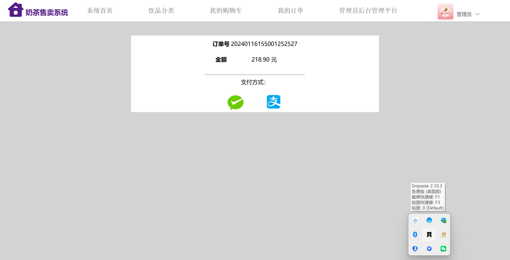
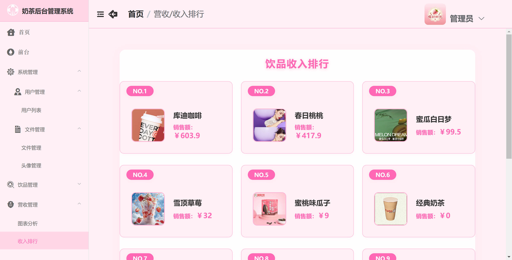

基于 Spring Boot 的奶茶商城系统（程序+论文）
=

### 完整代码获取地址：从戎源码网 ([https://armycodes.com/](https://armycodes.com/))
### 作者微信：19941326836  QQ：952045282 
### 承接计算机毕业设计、Java毕业设计、Python毕业设计、深度学习、机器学习
### 选题+开题报告+任务书+程序定制+安装调试+论文+答辩ppt 一条龙服务
### 所有选题地址https://github.com/nature924/allProject

一、项目介绍
---
基于 Spring Boot 的奶茶商城系统，系统角色为管理员（后台）和普通用户（前台），主要功能如下：

管理员（后台）：
基本操作：登录、获取/修改个人信息、登出
用户管理：分页/筛选用户、查看用户详情、新增/修改/删除用户、批量删除
轮播图与文件管理：轮播图列表/新增/查看/删除、文件/头像上传与管理
饮品（商品）管理：分页查询/查看详情、新增/修改/假删除、管理规格、推荐/排行设置
分类管理：分类列表/新增/删除/修改、下级分类与图标关联管理
订单管理：订单列表（分页）、查看订单详情、发货/修改订单状态
营收统计：收入图表与收入排行（用于后台数据可视化）
其它运维类：图标管理、文件管理等后台常用 CRUD

普通用户（前台）：
基本操作：注册、登录、获取/修改个人信息、上传头像
首页浏览：查看轮播/推荐商品、分类入口、商品列表
商品功能：查看商品详情（含规格/最低价）、按分类浏览
购物车：添加/修改/删除购物车项、查看购物车
订单流程：创建订单、支付标记、查看我的订单、确认收货
收货地址：增删改查用户收货地址

二、项目技术
---
- 编程语言：Java
- 数据库：MySQL
- 项目管理工具：Maven
- 前端技术：VUE、HTML、Jquery、Bootstrap
- 后端技术：Spring、SpringMVC、MyBatis

三、运行环境
---
- 操作系统：Windows、macOS都可以
- JDK版本：JDK1.8以上都可以
- 开发工具：IDEA、Ecplise、Myecplise都可以
- 数据库: MySQL5.7以上都可以
- Tomcat：任意版本都可以
- Maven：任意版本都可以

四、运行截图
---
### 论文截图：

### 程序截图：

